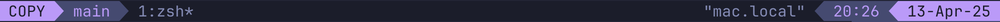

# tmux-status-mode

Plugin that changes the status bar colors depending on the currently active [tmux](https://github.com/tmux/tmux) mode.





The nested mode is active when `key-table` is turned off.

The default colors are loosely based on the ones from some [Neovim](https://github.com/neovim/neovim) plugins.

## Installation

### Installation with Tmux Plugin Manager

Add this repository as a [TPM](https://github.com/tmux-plugins/tpm) plugin to `.tmux.conf`:

```bash
set -g @plugin 'robinwhg/tmux-status-mode'
```

Press `prefix + I` in a tmux environment to install it.

### Manual Installation

Clone this repository:

```bash
git clone https://github.com/robinwhg/tmux-status-mode.git ~/.tmux/plugins/tmux-status-mode
```

Add this line in your `.tmux.conf` file:

```bash
run-shell ~/.tmux/plugins/tmux-status-mode/tmux-status-mode.tmux
```

Reload Tmux configuration file with:

```bash
tmux source-file ~/.tmux.conf
```

## Usage and customization

Like [Lualine](https://github.com/nvim-lualine/lualine.nvim), _tmux-status-mode_ has sections as shown below.

```txt
+-------------------------------------------------+
| A | B | C                             X | Y | Z |
+-------------------------------------------------+
```

Each sections holds its components e.g. tmux' current mode.

### Configuration

The plugin uses your default foreground and background color, so you should set it:

```bash
set -g status-style "fg=white,bg=black"
```

You might need to set the length of the `status-left` and `status-right`:

```bash
set -g status-left-length "100"
set -g status-right-length "100"
```

The following configuration options are available. You don't need to copy the defaults.

```bash
# Colors of the different modes
set -g @normal_mode_color "blue"
set -g @prefix_mode_color "green"
set -g @copy_mode_color "magenta"
set -g @sync_mode_color "cyan"
set -g @nested_mode_color "red"

# Section content
set -g @section_a " #{mode_indicator} "
set -g @section_b " #S "
set -g @section_c ""
set -g @section_x " \"#{=22:pane_title}\" "
set -g @section_y " %H:%M "
set -g @section_z  " %d-%b-%y "

# Section separators
set -g @separator_left ""
set -g @separator_right ""

# Background color of Section B and Y
set -g @section_by_bg "brightblack"

# Mode indicator text
set -g @normal_mode_indicator 'TMUX'
set -g @prefix_mode_indicator 'WAIT'
set -g @copy_mode_indicator 'COPY'
set -g @sync_mode_indicator  'SYNC'
set -g @nested_mode_indicator 'NEST'
```

The `#{mode_indicator}` token can be used in your configuration to show the name of the currently active mode (By default this is shown in `@section_a` of `status-left`).

### Notes

If you had some conflicting configurations set before, you may need to explicitly unset them for everything to work properly.

### Recipes

Style window-status to fit the aesthetic:

```bash
setw -g window-status-separator ""
setw -g window-status-format " #I #W #F "
setw -g window-status-current-format "#[fg=brightwhite,bg=default] #I #W #F "
```
